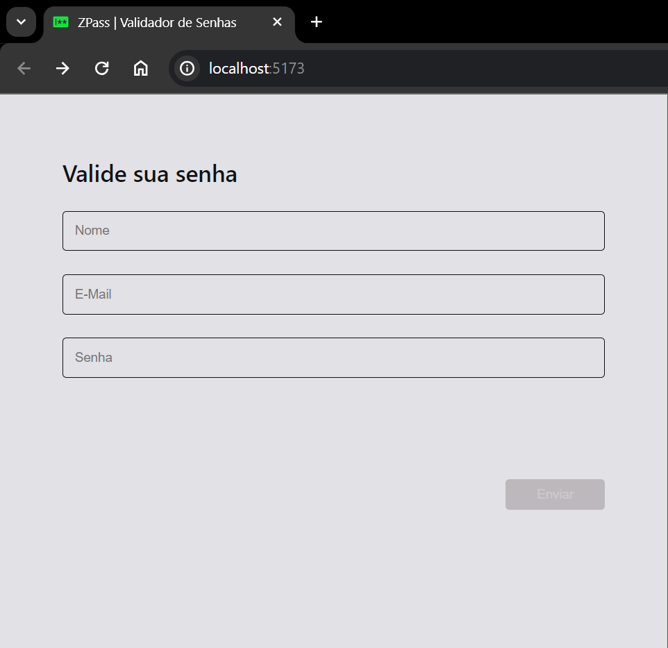
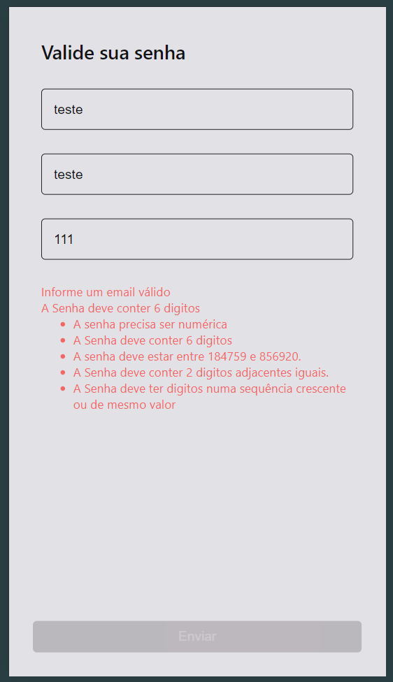
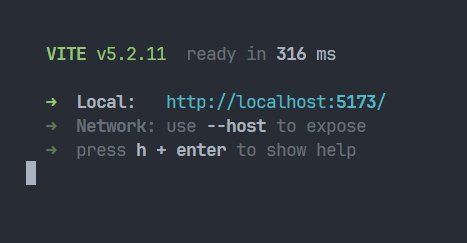
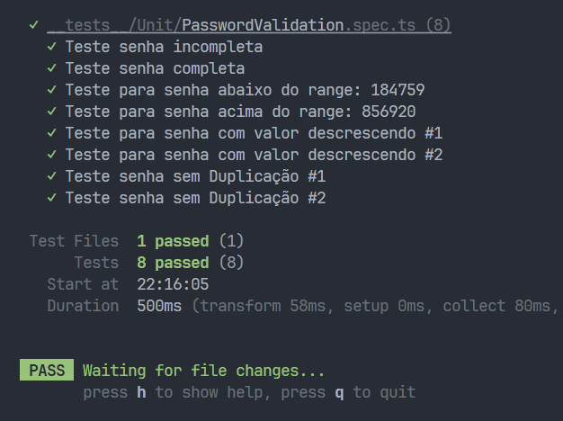
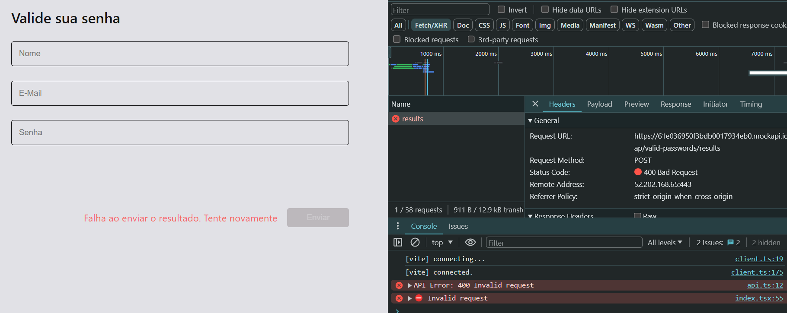
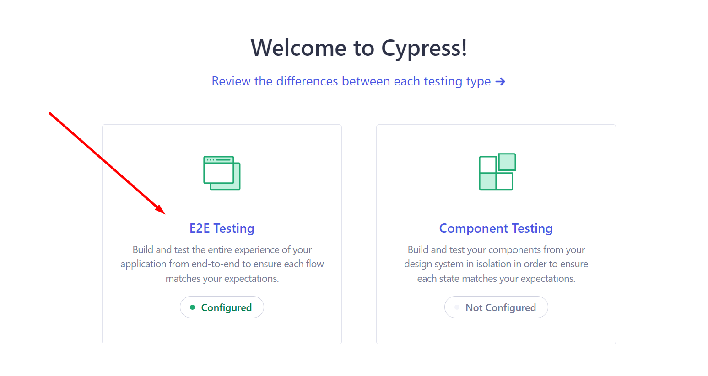
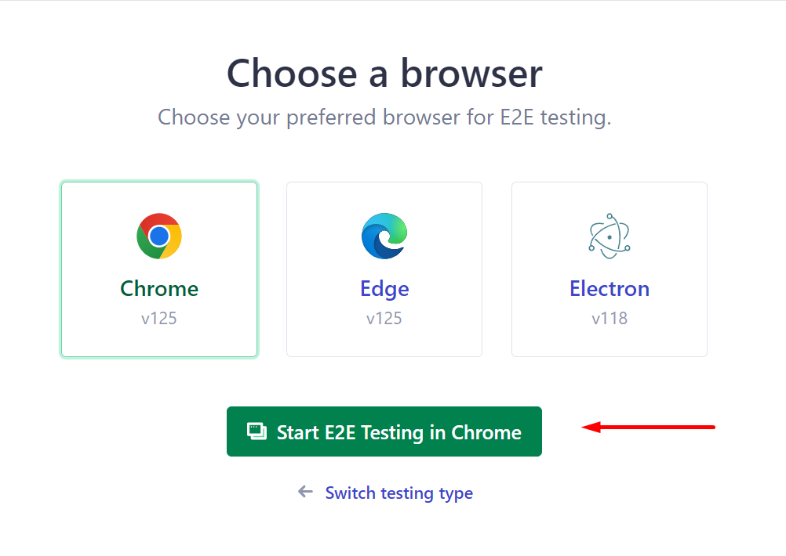
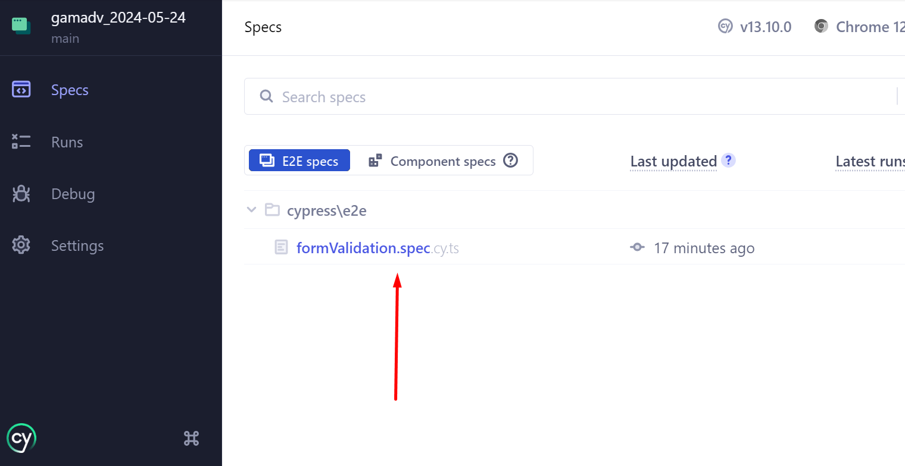
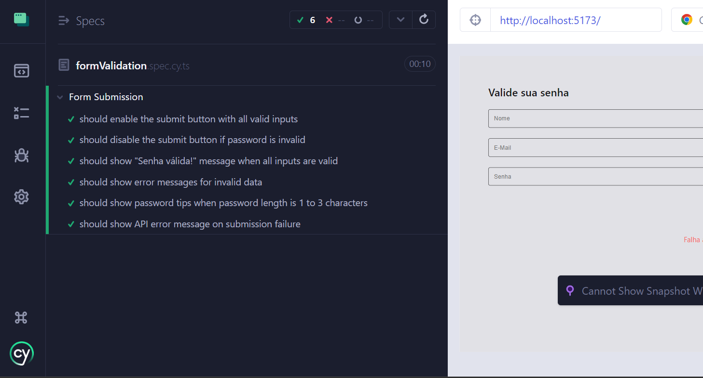

<div align=center>
  
</div>

<h1 align=center> ZPass
  <br />
  Validador de Senhas
</h1>


<div align=center>

    

</div>


# 📖 Sobre o projeto
Este projeto (apelidado carinhosamente de ZPass) visa realizar a validação de uma senha, após um problema detectado, e após validação é feito envio da senha fornecida pelo usuário, caso seja válida, poderá submeter o formulário. Caso inválida, informará ao usuário quais regras foram violadas.

Há também tratativas de erros para os demais campos.

Imagens sobre a responsividade:
<details>
  <summary>
      <strong>Desktop</strong>
  </summary>
  

</details>
<details>
  <summary>
      <strong>Mobile</strong>
  </summary>
  

</details>

<!-- ## Desktop -->
<!--  -->
<br />
<br />


# 🛠️ Tecnologias
* **Vite** com Typescript
* **React Hook Form** + Zod para validação e manipulação do formulário
* **Axios** para realizar requisições
* **Vitest** como Lib de tests
* **React-Router-DOM** para roteamento da aplicação.
* **Cypress** para melhor experiência em testes E2E

PS: Como não houve componentes genéricos ou reutilizáveis, não foi criado a famosa pasta src/components.

<br />

# ⚙️ Rodando o projeto

Para rodar Local, basta seguir os passos abaixo.

(Considerando já ter clonado repo, e com Node instalado na máquina)

Dependencias:

```bash
  $ npm install

  # or

  $ yarn
```

For Cypress on WSL or Ubuntu, must install:

```bash
  $ sudo apt-get install libgtk2.0-0 libgtk-3-0 libgbm-dev libnotify-dev libnss3 libxss1 libasound2 libxtst6 xauth xvfb
```

Após download, basta rodar

```bash
  $ npm run dev

  # or

  $ yarn dev
```

Projeto abrirá na porta:



# 🧪 Sobre Tests:
Foi criado testes unitários para cobrir possíveis cenários para o Validador de Senhas utilizado na aplicação:

```bash
  $ npm run test

  # or

  $ yarn test
```



É possível validar os cenários quanto a requisição trocando o Network para **SLOW 3G**, com isso conseguirá visualizar os campos desabilitados durante o envio

Para visualizar as mensagens de falha da requisição (CATCH), basta trocar as linhas desse arquivo: <i><kbd> [urls.ts](./src/constants/urls.ts)</i>
<br/>
Ou seja, modificando a API para uma que não existe, para verificar as tratativas de erro:




<br />
<br />
<br />

## Testes E2E
Basta rodar o projeto em conjunto com outro terminal com:
```bash
  $ npm run test:cy
```
Abrirá a GUI do Cypress, basta seguir esse caminho:

``
E2E Testing > Start E2E in (Browser de preferência) > Arquivo com testes: "formValidation.spec.cy.ts
``

</details>
<details>
  <summary>
      <strong>Passo a Passo em imagens</strong>
  </summary>
  
  
  

</details>
<br />


Após isso ele abrirá e executará os testes que estão nesse arquivo: <i><kbd> [formValidation.spec.cy.ts](./cypress/e2e/formValidation.spec.cy.ts)</i>





<p align=center>
  <h6 align=center>💙 Made by 💙</h6>
  <h2 align=center>
  <a href="https://www.linkedin.com/in/gama-leal">
    
    Moacir Gama
  </a>
  </h2>
</p>
